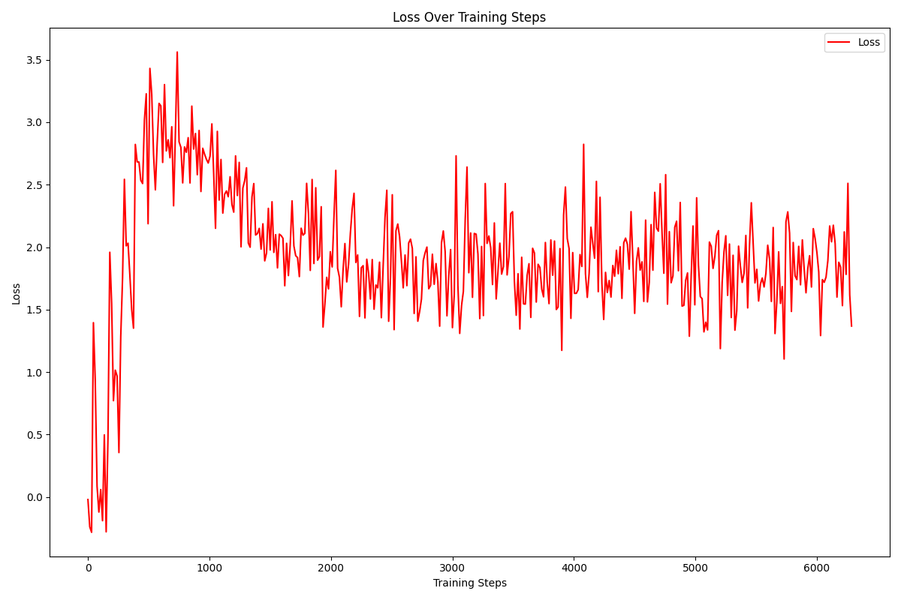
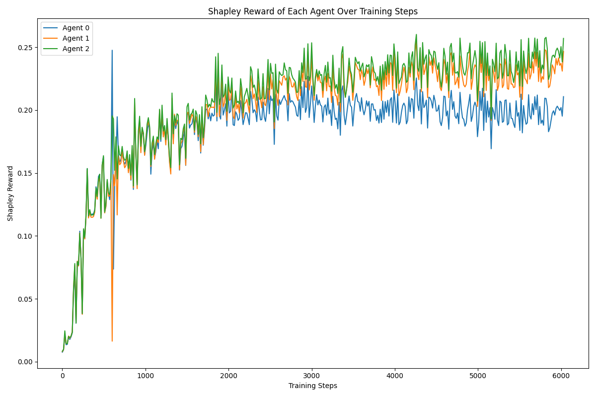

# Multi-Agent-PPO-on-SMAC
This repo works with python=3.11,  
Implementations of IPPO and MAPPO on SMAC, the multi-agent StarCraft environment. What we implemented is a simplified version, without complex tricks. This repository is based on [StarCraft](https://github.com/starry-sky6688/StarCraft).

## Corresponding Papers
[IPPO: Is Independent Learning All You Need in the StarCraft Multi-Agent Challenge?](https://arxiv.org/abs/2011.09533)  
[MAPPO: Benchmarking Multi-agent Deep Reinforcement Learning Algorithms](https://arxiv.org/abs/2006.07869)

## Results
### Loss Comparison between IPPO and MAPPO

### Loss Experiment

### Shapley rewards Experiment

### Comparison of 3 Models: IPPO, MAPPO, and Experiment

## Requirements
+ pytorch  
+ [StarCraftII (SMAC)](https://github.com/oxwhirl/smac)  
+ [pysc2](https://github.com/deepmind/pysc2)

## Run an experiment
Check out the [PIPELINE](https://colab.research.google.com/drive/1nmFmerjXRA_JYw5jyEmBrk8PP2Us_A9s)  
- Quick start:  
  `python3 main.py --map=3m --alg=ippo`

## Saving models and results
You can set the `model_dir` and `result_dir`, which can be found in `./common/arguments.py`. By default, all of the results and models are saved in `./model`.

## Replay
If you want to see the replay, make sure the `replay_dir` is an absolute path, which can be set in `./common/arguments.py.` Then the replays of each evaluation will be saved, and you can find them in your specified path.
